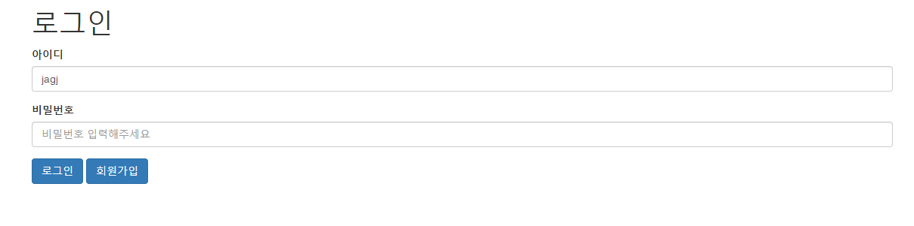

# 스프링 시큐리티(Spring Security)란?
Spring Security는 Spring 기반 애플리케이션의 보안을 담당하는 스프링 하위 프레임워크다.

# 왜 사용하는가 ??
Spring Security를 이용하면 "인증" 과 "권한"에 대해 쉽게 <STRIKE>나는 너무 어렵지만</STRIKE> 코드를 작성할 수 있도록 제공되기 때문에 사용한다.
그렇다면 인증 과 권한에 대해 조금 알아보자.

# 인증(Authentication)
흔히 로그인 할때 거치는 본인이 맞는지 확인하는 절차이다.

# 권한(Role)
인증된 사용자가 자원(Resource)에 접근 가능한지 결정하는 절차를 인가(Authoriation)라고 하는데 인가 절차를 거친 후 
사용자가 갖게되는 접근 가능한 권한을 의미한다.

# 스프링 시큐리티 시작하기
### 1.dependency 추가

maven
```
<dependency>
    <groupId>org.springframework.boot</groupId>
    <artifactId>spring-boot-starter-security</artifactId>
</dependency>
```

Gradle
```
implementation 'org.springframework.boot:spring-boot-starter-security'
```

### 2.기본 설정
WebSecurityConfig.java
```java
@Configuration
@EnableWebSecurity
@RequiredArgsConstructor
public class WebSecurityConfig extends WebSecurityConfigurerAdapter {
    private final UserService userService;

    @Override
    public void configure(WebSecurity web) throws Exception {
        //해당 요청은 인증 대상에서 제외
        web.ignoring().antMatchers( "/css/**", "/img/**");
    }

    @Override
    protected void configure(HttpSecurity http) throws Exception {
        http.authorizeRequests().antMatchers("/login", "/signUp", "/access_reject", "/resources/**").permitAll()
                .antMatchers("/userAccess").hasRole("USER")
                .antMatchers("/userAccess").hasRole("ADMIN")
                .and()
            .formLogin()
                .loginPage("/login")
                .loginProcessingUrl("/login_process")
                .successHandler(new LoginSuccessHandler())
                .and()
            .cors().disable()
            .csrf().disable()
    }
}
```
- @EnableWebSecurity 어노테이션을 선언함으로서 Spring Security를 활성화 시킨다.
- authorizeRequests() : HttpServletReuqest 요청 URL에 따라 접근 권한을 설정한다.
- antMatchers("/userAccess") : 요청 URL 경로 패턴을 지정
- permitAll() : 모든 유저에게 접근을 허용
- hasRole("USER") : USER라는 권한이 있다면 접근을 허용
- hasRole("ADMIN") : ADMIN라는 권한이 있다면 접근을 허용
- formLogin() : form Login 설정
- loginPage("/login") : 커스텀 로그인 페이지 경로와 로그인 경로를 설정
- loginProcessingUrl("login_process") : POST로 로그인 정보를 보낼 시 경로 (기본값은 /login)
- successHandler() : Spring Security에서 제공하는 FormLogin 성공시 항상 실행시키기 위함(AuthenticationFailureHandler를 구현)
- cors().disable() : Cors 설정하지않음
- csrf().disable() : Csrf 설정하지않음

### 3.로그인 커스텀 페이지 생성
login.jsp
```html
<html>
<head>
    <title>로그인</title>
</head>
<body>
<div class="container">
    <h1>로그인</h1>
        <form action="/login_process" method="post">
            <div class="form-group">
                <label for="id">아이디</label>
                <input type="text" name="username" id="id" class="form-control" placeholder="아이디 입력해주세요">
            </div>
            <div class="form-group">
                <label for="password">비밀번호</label>
                <input type="password" class="form-control" id="password" name="password" placeholder="비밀번호 입력해주세요">
            </div>
            <button type="submit" class="btn btn-primary">로그인</button>
            <button type="button" class="btn btn-primary" onClick="location.href='signUp'">회원가입</button>
        </form>
    <br/>
</div>
</body>
</html>
```
- WebSecurityConfig.java에서 loginProcessingUrl("login_process") 설정했으므로 Post 방식 이용

### 4.UserDetailsService를 상속 받은 UserService 생성
UserService.java
```java
public class UserService implements UserDetailsService {

    @Autowired
    private UserMapper mapper;

    @Override
    public UserVO loadUserByUsername(String username) throws UsernameNotFoundException {
        UserVO userVO = userMapper.getUser(username); //DB로부터 회원정보를 가져와 회원이 존재하는지 확인

        if(userVO == null) { 
            throw new UsernameNotFoundException("유저 정보 존재하지않음");
        }

        return userVO;
    }
}
```
- login_process가 실행되면서 자동으로 UserDetailsService 타입으로 Ioc 되어있는 loadUserByUsername 실행
- loadUserByUsername의 Parameter인 username는 login.jsp에 name=""값과 동일해야함.

### 5. AuthenticationSuccessHandler를 상속받은 LoginSuccessHandler 생성
LoginSuccessHandler.java
```java
@Override
public class LoginSuccessHandler implements AuthenticationSuccessHandler {
    @Override
    public void onAuthenticationSuccess(HttpServletRequest request, HttpServletResponse response, Authentication authentication) throws IOException {
        HttpSession session = request.getSession();
        session.setAttribute("name", authentication.getName());
        response.sendRedirect("/user_access");  
    }
}
```    
- 로그인 성공시 user_access로 Redirect

### 6.UserController 생성
UserController.java
```java
@Controller
public class UserController {

    @Autowired
    UserService userService;

    @GetMapping("/user_access")
    public String userAccess(Model model, Authentication authentication) {
        UserVO userVO = (UserVO) authentication.getPrincipal(); //현재 로그인한 유저의 정보를 받아온다.
        model.addAttribute("userInfo", userVO.getId() + "님의" + userVO.getUserName() + "님");
        return "user_access";
    }
}
```
- authentication 객체에 로그인한 유저정보(DB에서 가져온) 담겨져있음
- 로그인 성공시 결국엔 user_access.jsp로 이동

### 7.결과
#### -로그인 화면
### 
---
#### -로그인 성공시
### 

### 자세한 정보는
<https://github.com/gijoongjang/springSecurityExample>


