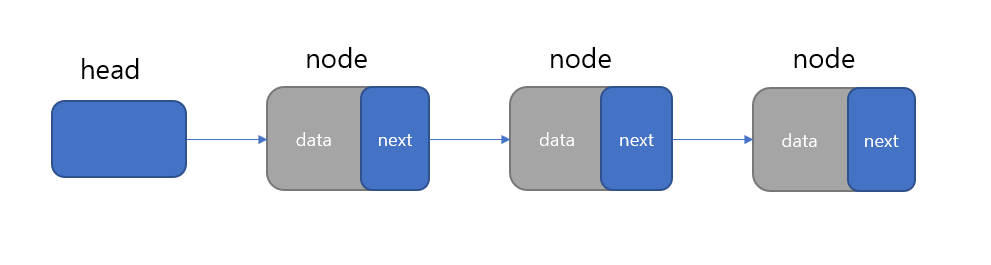

# LinkedList란?
LinkedList(연결리스트)는 각 노드가 '데이터와' '포인터'를 가지고 한줄로 연결되어 잇는 방식으로 저장하는 자료구조이다.

# LinkedList 구조 및 특징
### 
- head : 첫번째 노드를 가르킨다.
- data : 실제 값이 저장되는 장소이다.
- next : 다음 노드의 포인터나 참조값을 저장되는 장소이다.
- node : Vertex라고도 하며, 데이터가 저장되는 요소이다. (ArrayList에서는 element라고 한다.)
- ArrayList와는 달리 인덱스가 없어 데이터 검색시 처음부터 노드를 순회해야 하기 때문에 속도가 느리다. 
- ArrayList와는 달리 데이터의 추가 및 삭제시 불필요한 데이터의 복사가 없기 때문에 속도가 빠르다.
- 데이터 추가 및 삭제시 시간 복잡도는 O(1)
- 데이터 검색시 시간 복잡도는 O(N)

# LinkedList 구현 코드
Node.java
```java
public class Node {
    Object data;
    Node nextNode = null;
}
```
LinkedList.java
```java
public class LinkedList {
    private Node head;
    private int size;

    public LinkedList() {
        this.head = new Node();
        this.size = 0;
    }

    /**
     * 데이터 추가
     * @param data 
     */
    private void add(Object data) {
        Node node = head;
        Node newNode = new Node();
        newNode.data = data;

        while(node.nextNode != null) {
            node = node.nextNode;
        }
        node.nextNode = newNode;
        size++;
    }

    /**
     * 데이터 삭제
     * @param data 
     */
    private void remove(Object data) {
        Node node = head;

        while(node.nextNode != null) {
            if(node.nextNode.data == data) {
                node.nextNode = node.nextNode.nextNode;
                size--;
                break;
            }
            node = node.nextNode;
        }
    }

    /**
     * 데이터가 존재하는지 확인
     * @param data
     * @return boolean 
     */
    private boolean contains(Object data) {
        Node node = head;

        while(node != null) {
            if(node.data == data) {
                return true;
            }
            node = node.nextNode;
        }

        return false;
    }

    /**
     * 데이터 출력 위한 메서드 
     */
    private void showList() {
        Node node = head.nextNode;

        while(node.nextNode != null) {
            System.out.print(node.data + ",");
            node = node.nextNode;
        }

        System.out.println(node.data);
    }

    public static void main(String args[]) {
        LinkedList list = new LinkedList();

        list.add("1");
        list.add("2");
        list.add("3");

        list.showList();
        System.out.println("contains : " + list.contains("3"));

        list.remove("3");
        list.remove("2");

        list.showList();
        System.out.println("contains : " + list.contains("3"));

    }
}
```

### 자세한 정보는
<https://github.com/gijoongjang/javaStudy/blob/master/src/linkedList>


