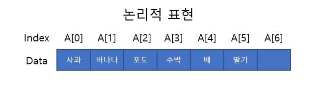
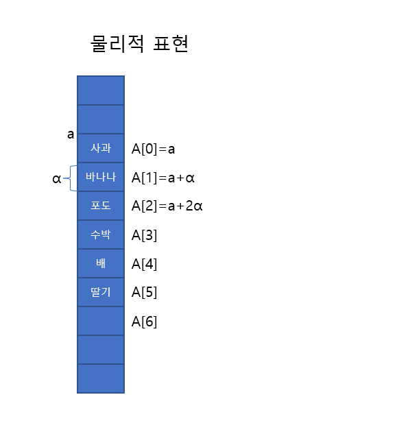
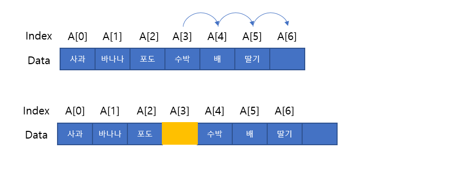
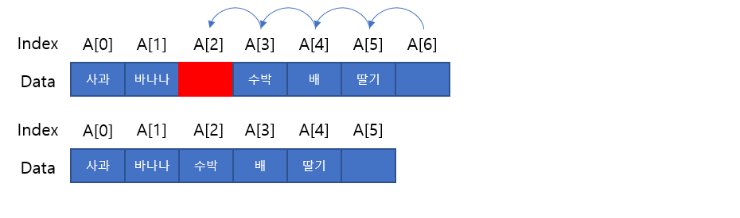

# 배열(Array)이란?
같은 자료형을 갖는 여러개의 데이터를 하나의 변수로 모아놓은 데이터의 집합체이다.
논리적으로 생각해보면 아래와 같이 나타낼 수 있다.
### 
하지만 실제로는 컴퓨터에서 메모리에 표현되는 방식은 아래와 같이 <B>연속적으로</B> 할당되게 된다.
### 

# 배열(Array)의 특징
- 논리적 표현과 물리적 표현의 순서가 같다.
- 데이터를 조회할 때 인덱스를 이용하여 바로 찾기때문에 검색 속도가 빠르다.
- 데이터를 삽입/삭제시 데이터의 이동(재구성)이 발생한다.

# 배열의 시간복잡도
- 임의 위치 원소 확인 : O(1) 
  인덱스를 이용하여 위치를 찾고 바로 확인할 수 있다.
- 가장 끝에 원소 추가 : O(1)
- 가장 끝에 원소 삭제 : O(1)
- 임의 위치에 원소 추가 : O(N) 
 인덱스 3의 위치에 새로운 원소를 삽입 하려고 하면 그 뒤에 존재하는 모든 원소들은 한 칸씩 뒤로 밀리게 된다.
 ### 
- 임의 위치에 원소 삭제 : O(N) 
 추가와 마찬가지로 삭제도 O(N)이 걸리는데, 인덱스2의 위치에 원소를 제거시 그 뒤에 모든 원소들은 한 칸씩 앞으로 당겨지게 된다.
 ### 

 # 결론
  데이터의 개수가 정해져 있을 때 사용하기 용이하며 연결리스트에 비해 검색 속도가 빠르고, 
  삽입/삭제가 빈번한 작업이 있을 경우에는 연결리스트에 비해 느리다.

  
