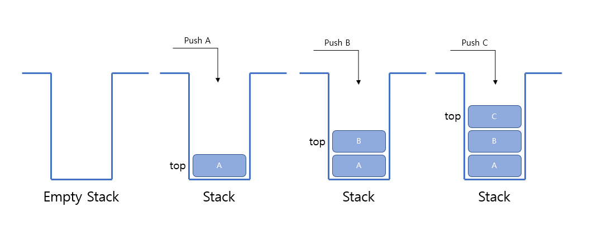
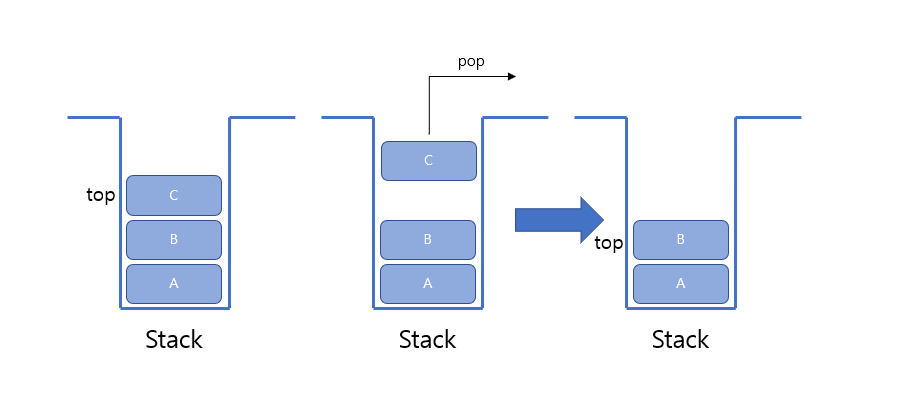
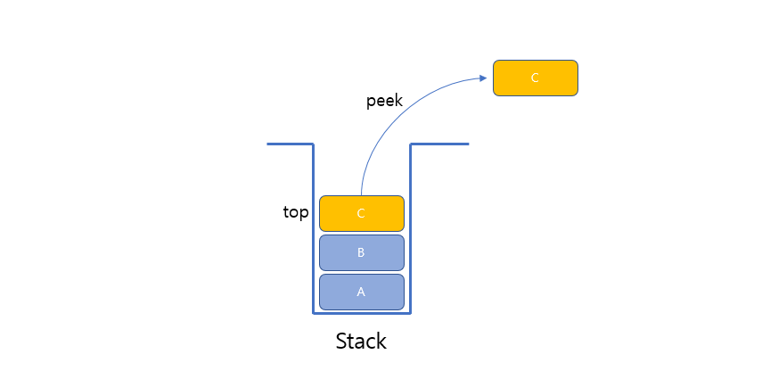

# 스택(Stack)이란?
데이터의 삽입과 삭제가 한쪽 끝에서만 이루어져 데이터를 쌓는 선형리스트 자료구조이다.

# Stack 특징
 - 가장 먼저 들어간 값이 가장 나중에 나오는 LIFO(Last In First Out) 구조
 - 스택이 꽉 차있을때 자료를 넣으려 할때 스택 오버플로우(Stack Overflow)가 발생한다.
 - 스택이 비어있을 때 자료를 꺼내려 할때 스택 언더플로우(Stack Underflow)가 발생한다.

# Stack 사용법

## 1. Stack 선언하기
```java
Stack<String> stack = new Stack<>();
```

## 2. Stack 값 추가(Push)
```java
Stack<String> stack = new Stack<>();
stack.push("A"); //데이터 삽입
stack.push("B");
stack.push("C");
```
## 

## 3. Stack 값 삭제(Pop)
```java
stack.pop(); //데이터 삭제
```
## 

## 4. Stack의 최상단(Top) 값 확인
```java
stack.peek(); //데이터 최상단(TOP) 값 확인
```
## 

## 5. Stack 기타 메서드
```java
Stack<String> stack = new Stack<>();
stack.push("A"); 
stack.push("B");
stack.push("C");
stack.size();       // stack의 크기 출력 : 3
stack.empty();      // stack이 비어있는지 확인 (비어있다면 true 비어있지 않다면 false)
stack.contains("C") // stack에 'C'가 존재하는지 확인 (있다면 true 없다면 false)
```

# Stack 구현 코드
```java
import java.util.EmptyStackException;

public class ArrayStack {
    private int top;
    private int maxSize;
    private Object[] stackArray;

    public ArrayStack(int maxSize) {
        top = -1;
        this.maxSize = maxSize;
        stackArray = new Object[maxSize];
    }

    /**
     * Stack이 비어있는지 체크
     * @return boolean (if stack empty ? true : false)
     */
    private boolean isEmpty() {
        return top == -1;
    }

    /**
     * Stack에 객체를 삽입
     * @param data
     */
    public void push(Object data) {
        stackArray[++top] = data;
    }

    /**
     * Stack의 맨 위에 객체 꺼냄
     * @return Object
     */
    public Object pop() {
        if(isEmpty()) {
            System.out.println("꺼낼 데이터 없음!!!");
            throw new EmptyStackException();
        }

        Object data = stackArray[top--];

        return data;
    }

    /**
     * Stack에 맨 위에 저장된 객체 반환
     * @return Object
     */
    public Object peek() {
        if(isEmpty()) {
            System.out.println("데이터 없음!!!");
            throw new EmptyStackException();
        }

        return stackArray[top];
    }

    public void print() {
        if(isEmpty()) {
            System.out.println("스택 비어있음");
        }

        for(int i = top; i >= 0; i--) {
            System.out.println(String.format("%s번째 data : %s", i+1, stackArray[i]));
        }
    }

    public static void main(String[] args) {
        ArrayStack stack = new ArrayStack(10);

        stack.print();

        stack.push(1);
        stack.push(2);
        stack.push(3);

        stack.print();
        System.out.println("top : " + stack.peek());

        stack.pop();
        stack.pop();
        stack.print();

        stack.pop();
        stack.print();
    }
}
```