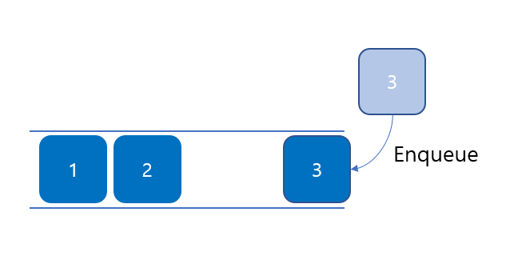
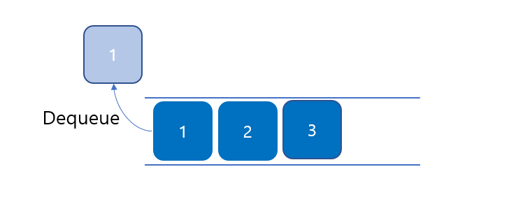
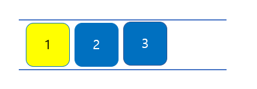

# 큐(Queue)란?
한쪽 끝에서는 데이터의 삽입만 이루어지고 다른 한쪽 끝에서는 데이터의 삭제만 이루어지는 선형리스트 자료구조이다.

# Queue의 특징
- 먼저 들어간 데이터가 먼저 삭제가 되는 FIFO(First In First Out) 구조이다.
- 삭제가 이루어지는 곳을 Front/Head 삽입이 이루어 지는곳을 Rear/Tail이라고 한다.

# Queue 사용법
## 1. Queue 선언하기
```java
Queue<Integer> queue = new LinkedList<>();
```

## 2. Queue 값 추가(Enqueue)
```java
Queue<Integer> queue = new LinkedList<>();
queue.offer(1); //데이터 삽입
queue.offer(2);
queue.add(3);   //데이터 삽입
```
## 
offer() 와 add() 메서드는 값을 추가 하는건 똑같지만 add() 는 큐가 꽉 찬경우에 IllegalStateException 예외를 던지고 offer()는 추가 실패를 의미하는 false를 리턴한다.

## 3. Queue 값 삭제(Dequeue)
```java
queue.poll();       // queue에 맨 앞에 있는 값 반환 후 삭제
queue.remove();     // queue에 맨 앞에 있는 값 반환 후 삭제
queue.clear();      // queue 전체를 비운다.
```
## 
poll() 과 remove() 메서드는 값을 삭제 하는건 같지만 poll()는 삭제 할 값이 없다면 null을 반환하지만<br/>
remove()는 큐가 비어 있다면 NoSuchElementException 예외를 발생시킨다.

## 4. Queue에 맨 앞 데이터 확인
```java
queue.element();    //맨 앞에 값 반환
queue.peek();       //맨 앞에 값 반환
```
## 
element() 와 peek() 메서드는 맨 앞 데이터를 확인 하는건 같지만 element()는 큐가 비어 있는 경우에<br/>
NoSuchElementException 예외를 발생기키고 peek()는 비어있을 경우에 null을 반환한다.

# Queue 구현 코드
```java
public class ListQueue<T> {

    static class Node<T> {
        T data;
        Node<T> next;

        public Node(T data) {
            this.data = data;
        }
    }

    private Node<T> head;

    private boolean isEmpty() {
        return head == null;
    }

    public T add(T item) {
        Node<T> node = new Node<T>(item);

        if (isEmpty())
            head = node;

        head.next = node;

        return node.data;
    }

    public T remove() {
        if (isEmpty())
            throw new RuntimeException();

        T data = head.data;
        head = head.next;

        return data;
    }

    public T peek() {
        if (isEmpty())
            throw new RuntimeException();

        return head.data;
    }

    public void print() {
        Node<T> node = head;

        while(node != null) {
            System.out.print(node.data + " ");
            node = node.next;
        }
        System.out.println();
    }

    public static void main(String[] args) {
        ListQueue<String> queue = new ListQueue<>();

        queue.add("A");
        queue.add("B");
        queue.print();
        System.out.println("front : " + queue.peek());

        queue.remove();
        queue.print();
    }
}
```