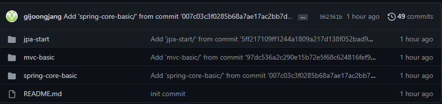

## 깃허브 레포지토리 합치는 방법을 알아보자.

### 1. 먼저 상위 레포지토리를 생성 해준다.
## 

### 2. 상위 Repository를 로컬저장소랑 연결해준다.
#### 1) 먼저, 연결해줄 Repository의 주소를 복사한다.

## 
#### 2) Clone 해온 url로 해당 명령어로 Clone해준다.
```powershell
$ git clone <url>
#ex)
$ git clone https://github.com/gijoongjang/inflearn-study.git
```

### 3. clone 한 Repository에 README.md 파일을 push해준다.
#### 파일을 추가 해줘야 이후에 오류가 나지 않는다.
```powershell
$ >> README.md                #step1
$ git add README.md           #step2
$ git commit -m "init commit" #step3
$ git push                    #step4
```

### 4. 합치고 싶은 하위 Repository들을 상위 Repository로 합친다.
```powershell
$ git subtree add --prefix=하위레포지토리명 하위레포지토리의주소 하위레포지토리브랜치
#ex)
$ git subtree add --prefix=jpa-start https://github.com/gijoongjang/jpa-start.git master
$ git subtree add --prefix=mvc-basic https://github.com/gijoongjang/mvc-basic.git master
$ git subtree add --prefix=spring-core-basic https://github.com/gijoongjang/spring-core-basic.git master 
```

### 5. 마지막으로 Push
```powershell
$ push
```

#### Push까지 진행 하면 아래와 같이 레포지토리가 합쳐진걸 확인 할 수 있다.
## 


